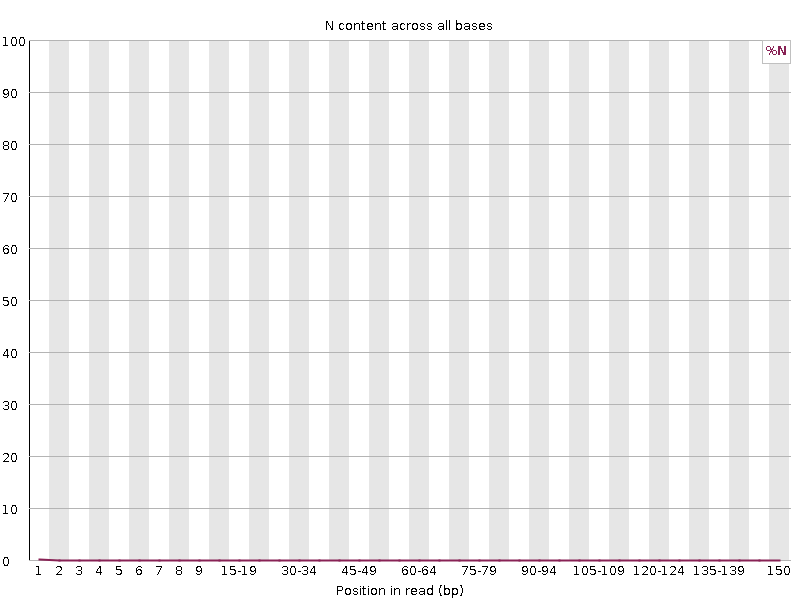

```{r setup, include=FALSE}
knitr::opts_chunk$set(echo = TRUE)
```

## Part 1

### FASTQC Plots

**SRR25630311_1:**


**SRR25630311_2:**


**SRR25630392_1:**


**SRR25630392_2:**




**Analysis**

The sequencing data show consistently high per-base quality scores across the entire read length, with median Phred values remaining well within the reliable range. This strong quality profile is directly reflected in the per-base N content plot, which shows an absence of undetermined bases throughout the reads. The agreement between the two plots indicates that base calling was highly accurate, with no evidence of uncertainty or ambiguity across positions.This is true for all four cases.

### My script plots

**SRR25630311_1:**


**SRR25630311_2:**


**SRR25630392_1:**


**SRR25630392_2:**


**Analysis** Well, they look basically the same, the only differnce is the scale, but taking that into account they are basically the same. When I compared the runtimes and memory usage between FastQC and my own script, the difference was clear. For the larger SRR25630311 dataset, FastQC finished in about eight and a half minutes but used close to 700 MB of memory, while my script took almost fourteen minutes per read file but only needed around 60 MB. For the smaller SRR25630392 dataset, FastQC ran in under a minute with about 600 MB of memory, while my script took about a minute and a half with the same low memory footprint. What I noticed is that FastQC is much faster because it is a compiled, optimized program that uses multiple threads and trades off higher memory usage for speed. My Python implementation with the running sum strategy, on the other hand, is much lighter on memory but slower since it is interpreted code and not as optimized for performance. So in my runs, FastQC consistently finished quicker, but my script was more efficient in memory.

### Overall data quality of two libraries

1.  **SRR25630311_1.fastq:** The FastQC results show that the sequencing data is overall very good. The quality scores are high across the whole read length (Phred >34, so error rates are very low), and most reads are high quality as expected. All reads are 150 bp long, so trimming for read length isn’t needed.

There is a small amount of adapter contamination near the ends, but that can be easily fixed with trimming. The N content is basically zero, meaning base calls are confident. Base composition shows a little bias at the start (common with Illumina), but it evens out quickly. GC content is centered around 50% with only minor variation. The per-tile quality is almost entirely good, with just a tiny patch of lower quality that doesn’t matter.

Overall, these libraries are high quality and ready for downstream analysis.

2.  **SRR25630311_2.fastq:** TThe second library still shows strong overall quality. Per-base scores are mostly above 30, though they drop off at the ends, which is normal for Illumina and can be fixed with trimming. All reads are 150 bp long, so trimming won’t cause variable read lengths. Adapter content is low and only rises slightly at the ends, while N content is zero and GC content is close to expected, with only small deviations.

One difference from the first dataset is the sequence duplication plot in FastQC, which shows that less than 20% of reads are unique. This suggests high duplication, possibly from PCR bias or low input complexity, and it could impact some downstream analyses. The base composition shows some early bias, but it stabilizes quickly.

Overall, most reads are still very high quality, so this library can still be used for downstream analysis

3.  **SRR25630392_1.fastq:** The SRR25630392_1.fastq library looks pretty good overall. Base quality scores stay high (mostly above 30) across the read, with only a small drop at the very end that trimming can fix. All the reads are 150 bp long, so length isn’t an issue.

Adapter contamination is very low and only shows up at the ends, and there are basically no N’s, meaning the base calls are confident. The GC content looks close to what’s expected, and most reads have high average quality.

The sequence duplication plot in FastQC shows that only about 40% of reads are unique. This suggests some redundancy in the data, likely from PCR bias or low input complexity, so there’s a bit less diversity than ideal.

Even with that, the library is still high quality and fine to use for downstream analysis.

4.  **SRR25630392_2.fastq:** The SRR25630392_2.fastq library looks strong overall. Base quality scores are high (mostly above 30) across the read, with only a small drop at the 3′ end that trimming can fix. All reads are 150 bp long, so length isn’t an issue.

Adapter content is very low and only shows up at the very end, and there are basically no N’s. The GC content matches what we’d expect, and most reads have high average quality.

The sequence duplication plot in FastQC shows that about 42% of reads are unique. This suggests a moderate level of redundancy in the data, which could come from PCR amplification or naturally abundant sequences (like highly expressed genes), but it’s not extreme. The per-tile quality is mostly uniform, with only a few faint low-quality spots that aren’t a big concern.

Overall, this dataset is high quality and suitable for downstream analysis


## Part 2


### Analysis of graphs

For **SRR25630311**, R1 and R2 look almost identical, with most reads still at full length, so adapter trimming was minimal. 

For **SRR25630392**, both R1 and R2 also show nearly all reads at full length, so adapter trimming was minimal here too. 

## Part 3

| Sample      | Mapped Reads | Unmapped Reads |
|-------------|--------------|----------------|
| SRR25630311 | 33,556,239   | 9,353,061      |
| SRR25630392 | 7,522,866    | 492,812        |
